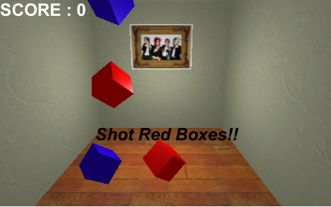
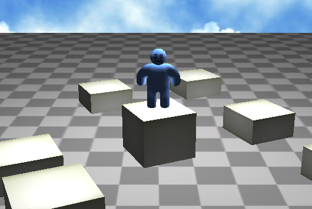
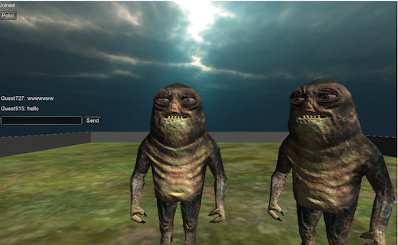

<h2>Unity</h2>

Unityのサンプル一覧です。 
中には古いものなどもありますので参考にする程度でお願いします。 
基本的には自分用ですので。 

•基本構成 
>プロジェクトフォルダ 
  >>Unity Web App Sample 
  >>Unity Souce

<h2>更新</h2>
2014/03/09  05_PhotonCloudSample追加 
2014/03/07  01_ShotGunGame追加 
2014/03/07  02_CoinCrazy追加 
2014/03/07  03_BallGame追加 
2014/03/07  04_AngryBirdTist追加 

<h2>•01_ShotGunGame</h2>
ブロックショットゲームのサンプル 
指定された色をクリックで破壊してスコアを稼ぐ 

<!-- ******************************************* -->

<h2>•02_CoinCrazy</h2>
ひたすら避けてコインのみを取るゲームのサンプル 
指定された色をクリックで破壊してスコアを稼ぐ 

<!-- ******************************************* -->

<h2>•03_BallGame</h2>
バランスボールゲームのサンプル 
赤いエリアを避けて、3つのボールを同時に青いエリアにいれる 

<!-- ******************************************* -->

<h2>•04_AngryBirdTist</h2>
例のアングリーバード的なサンプル 
破壊するのみ！ 

<!-- ******************************************* -->

<h2>•05_PhotonCloudSample</h2>
PhotonCloudを利用したチャットのサンプル 
基本的なチャット機能とプレイヤーの動きの同期のみ 

